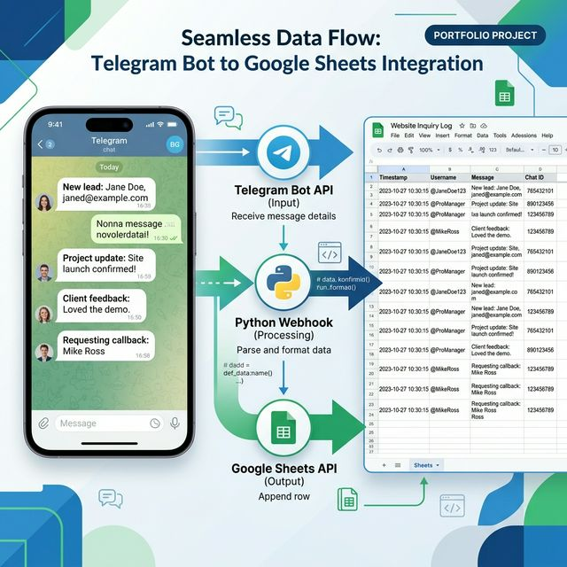

# Telegram to Google Sheets Automation

Instantly syncs Telegram messages to a Google Sheet for automated data collection and tracking.

✔ Eliminates manual data entry by logging messages instantly
✔ Scales seamlessly from local polling to production webhook mode
✔ Keeps credentials secure with zero hardcoded secrets

## Use Cases
- **Lead Generation:** Automatically log inquiries from a Telegram bot directly into a shared spreadsheet.
- **Customer Support:** Track and archive support tickets or feature requests from community members.
- **Data Collection:** Gather structured information (like orders or feedback) securely and consistently.

## Project Structure

```
telegram-sheets-logger/
├── bot.py              # Bot logic + Sheets integration
├── requirements.txt
├── .env.example
└── credentials.json    # Google service account (git-ignored)
```

## Setup

### 1. Create a Telegram Bot
Get your bot token from [@BotFather](https://t.me/BotFather).

### 2. Google Sheets Service Account
1. Go to [Google Cloud Console](https://console.cloud.google.com/)
2. Create a project → enable **Google Sheets API** and **Google Drive API**
3. Create a **Service Account** → download `credentials.json`
4. Share your Google Sheet with the service account email

### 3. Install & Configure

```bash
pip install -r requirements.txt
cp .env.example .env
# Fill in TELEGRAM_TOKEN, SPREADSHEET_ID
# Place credentials.json in project root
```

## Configuration (`.env`)

| Variable | Description |
|---|---|
| `TELEGRAM_TOKEN` | Bot token from BotFather |
| `SPREADSHEET_ID` | Google Sheet ID (from URL) |
| `WORKSHEET_NAME` | Sheet tab name (default: `Logs`) |
| `GOOGLE_CREDENTIALS_FILE` | Path to service account JSON |
| `WEBHOOK_URL` | Public HTTPS URL (leave empty for polling) |
| `WEBHOOK_PORT` | Port for webhook server (default: `8443`) |

## Usage

```bash
# Local development (polling mode)
python bot.py

# Production (set WEBHOOK_URL in .env)
python bot.py
```

## Example Sheet Output

| Timestamp (UTC) | User ID | Username | First Name | Message |
|---|---|---|---|---|
| 2024-05-15 10:30:00 | 123456789 | johndoe | John | Hello world |
| 2024-05-15 10:31:15 | 123456789 | johndoe | John | Order #1042 received |

## Tech Stack

`python-telegram-bot` · `gspread` · `google-auth` · `python-dotenv`

## Screenshot



